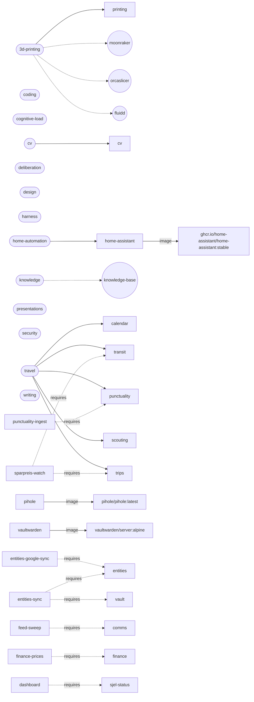

# Sjel Architecture

> Auto-generated by tools/generate-architecture.sh. Do not edit manually.
> Generated: 2026-10-01T12:14:38Z | Source: axon.toml + upstreams.toml + systems.toml + capabilities/ + Packs/

See the [engineering doctrine](CONTRIBUTING.md#engineering-doctrine) this generated view reflects.

## Capabilities

| Capability | What | Service | Port | Panel |
|---|---|---|---|---|
| `agentbox` | A coding agent in a disposable container, talking to a model server on the host. | — | — | — |
| `backup` | Every capability's backup contract: the run, the surface that manages it, and the record of what each attempt did. | — | — | — |
| `calendar` | Sjel's personal calendar layer: the source of truth for what time means on any given day — availability windows for travel, on‑site work, remote‑work blocks, busy periods, events you're attending, rhythms that materialize those blocks, and (later) day‑planning detail. | — | `8087` | — |
| `comms` | General observed-information intake for Sjel, plus reviewed mail triage. | — | `8083` | — |
| `container-refresh` | The daily pull of every image this machine declares, and the recreate for the ones whose digest moved. | — | — | — |
| `cv` | One master CV, tagged and bilingual, built into job-specific PDF variants. | — | — | — |
| `devices` | The deployment's device registry. | — | `8098` | — |
| `entities-google-sync` | The scheduled Google Contacts sync for [`capabilities/entities`](../entities/). | — | — | — |
| `entities-sync` | The scheduled Obsidian sync for [`capabilities/entities`](../entities/). | — | — | — |
| `entities` | Sjel's system of record for people, organisations, places and the operator's own context. | — | `8097` | — |
| `feed-sweep` | The scheduled source collector for [`capabilities/comms`](../comms/). | — | — | — |
| `finance-prices` | The nightly market-price fetch. | — | — | — |
| `finance` | Journal-backed cash flow, reviewed bank imports and subscriptions with append-only price and state history. | — | `8090` | — |
| `foundation-models` | Apple's on-device model, served over the OpenAI chat-completions shape on loopback. | — | `8091` | — |
| `home-assistant` | Reusable Home Assistant runtime contract. | ghcr.io/home-assistant/home-assistant:stable | — | — |
| `host-firewall` | A default-deny host firewall for a Linux node, rendered from the active overlay's declaration. | — | — | — |
| `host-net` | What this host exposes to the network, read without sudo. | — | — | — |
| `host-patch` | The daily upgrade of this machine's tools, and the audit that runs over the machine it just patched. | — | — | — |
| `host-watch` | The machine's own vital signs, checked hourly, reported only when something crosses a line. | — | — | — |
| `interior` | Misst Layouts gegen die Räumungsregeln einer Wohnung und sucht Positionen, die sie erfüllen. | — | `8092` | — |
| `knowledge-base` | The vault, as a thing that gets backed up. | — | — | — |
| `knowledge-graph` | REST API over the Sjel code-dependency graph built by [graphify](https://github.com/safishamsi/graphify). | — | `4244` | — |
| `macmon` | What this machine's silicon is actually doing — temperature, power draw, CPU and GPU utilisation, memory — read without sudo. | — | `9911` | — |
| `media` | An exact-byte ingest gate and integrity ledger for a library on mounted volumes. | — | — | — |
| `packs` | What Sjel has deployed into each agent harness on this machine, and the proof that it did. | — | — | — |
| `people-registry` | Rung 0's known-person registry, refreshed from the vault every six hours. | — | — | — |
| `pihole` | Reusable Pi-hole runtime contract for a private network. | pihole/pihole:latest | — | — |
| `places` | Canonical place registry, geocode cache, and the map layers above finance, trips, transit and the companion register. | — | `8093` | — |
| `printing` | Home 3D printing, driven safely from the terminal: slice, upload, arm, print, monitor an Elegoo Neptune 4 (Klipper/Moonraker) without touching the vendor cloud. | — | — | — |
| `punctuality-ingest` | The scheduled producer for [`capabilities/punctuality`](../punctuality/). | — | — | — |
| `punctuality` | How reliable a German train actually is, measured rather than predicted. | — | `8085` | — |
| `scouting` | A generic opportunity-discovery pipeline: scrape a source (events, CFPs/scholarships, ...), normalize into one shared `Opportunity` type, score it against a configurable "interest profile" via embeddings/cosine similarity, rank, persist, and optionally cross-reference against existing notes. | — | `8084` | — |
| `shell` | Portable shell config — theme, completions, aliases, functions. | — | — | — |
| `sjel-status` | What this machine has enabled, what is up, and the one thing allowed to start it. | — | `8082` | — |
| `soundscape` | Generative audio that follows what you are doing. | — | `8088` | `8088/` |
| `sparpreis-watch` | The Sparpreis price watch (travel PRD R4). | — | — | — |
| `store` | The one SQLite file every capability's tables live in. | — | — | — |
| `transit` | HAFAS journey search, split-ticket solving, German rail ticket extraction, trip persistence, and fuzzy/triggered trip-search sessions. | — | `3000` | — |
| `traveler` | The traveller profile: the hard limits a search must obey, the ranking weights that are the traveller's rather than the repo's, the interests that were already being typed into a form and read by nothing, and one provenance entry per field saying whether a value was stated, derived, proposed, or is still the built-in default. | — | `8096` | — |
| `trips` | Persistent user intent and itinerary state for Sjel's cross-capability Trips workspace. | — | `8086` | — |
| `vault` | Reads an Obsidian vault as data. | — | `8094` | — |
| `vaultwarden` | Reusable Vaultwarden runtime contract. | vaultwarden/server:alpine | — | — |

## Dashboard (spine shell)

The spine's one app — discovers installed capabilities via their manifests and mounts
their panels; owns no domain, no data. See [Three architectural nouns](CONTRIBUTING.md#three-architectural-nouns).

| App | What | Port |
|---|---|---|
| `dashboard` | The spine's shell. | `47117` |

## Libs

Spine-owned shared code with no domain of its own — statically linked into capability
binaries at compile time. See [Three architectural nouns](CONTRIBUTING.md#three-architectural-nouns).

| Lib | What |
|---|---|
| `candidate-fingerprint` |  |
| `civil-date` | Howard Hinnant's civil-from-days pair, written once. |
| `content-item` | The `content-item-v2` reader contract in Rust. |
| `extraction` | One home for **turning a fetched document into text**, and for the question of who gets to read which kind of document. |
| `inference` | One home for **which model answers which job on this machine**. |
| `markdown-root` | A declared markdown root, and the only way to get a file out of it. |
| `overlay` | Shared TypeScript resolution of Sjel's selected deployment overlay. |
| `pseudonymize` | Reversible bidirectional session tokenization for cloud evaluators and agents (PRD §6.2c, Q112, Slice P1). |
| `roomplan-contract` |  |
| `route-manifest` | A self-describing HTTP surface. |
| `sjel-config` | Shared overlay/config resolution for Sjel's Rust capabilities: tilde expansion, overlay paths (`SJEL_PERSONAL_ROOT`), the store's location, the deployment's home timezone, and the runner's port contract (`SJEL_PORT` first, capability escape hatch second, config file third, shipped default last). |
| `sjel-http` | One home for **outbound HTTP**: the blocking client, the user-agent every Sjel request carries, and the timeout no caller can forget. |
| `sjel-server` | The one way a capability server comes up: `resolve_port` (re-exported from `sjel-config`: `SJEL_PORT` from the runner first, capability escape hatch second, config third, shipped default last), a loopback-only bind, **the inbound authentication gate**, uniform startup logging, and a named single-line exit on bind failure instead of a panic backtrace. |
| `sjel-store` | One home for **how a capability opens the shared database, and when its migration runs**. |
| `station-time` | Timezone-correct arithmetic for station-local times. |
| `summarize` | One home for **how much digest a thing is worth**. |

## Packs

| Pack | Description | Skills | Drives |
|---|---|---|---|
| `3d-printing` | Slice + drive a home Klipper/Moonraker 3D printer safely from the terminal. | home-3d-printing | printing |
| `coding` | Engineering craftsmanship across backend and frontend: systems-grade Rust, official Svelte 5 and TypeScript. | effective-rust, svelte-core-bestpractices, svelte-code-writer | — |
| `cognitive-load` | Shape agent output for a constrained reader: the ADHD output style, which leads with the next action and restates state every turn, and ASD-STE100 controlled language for strings an agent must parse without ambiguity. | attention-control, asd-ste100 | — |
| `cv` | Build job-tailored CV PDFs from one profile-tagged master file, via Typst. | cv-builder | cv |
| `deliberation` | Five ways to work a decision: produce candidate options when there are none, crystallize an unstructured mess into a precise document, convene a council that debates the options, red-team the proposal that wins, and root-cause the failure when one happens anyway. | diverge, crystallize, council, red-team, root-cause | — |
| `design` | UI craftsmanship, dense operational interface design, anti-vibe-coding doctrine, typography, and mechanical sympathy. | ui-craftsmanship | — |
| `harness` | Keep the agent system and its repository in shape: operate and change Sjel, propose the skills the recorded work actually needs, shrink what loads into every session, and keep every harness in step with the Packs that feed it. | sjel, suggest-skills, trim, harness-sync | — |
| `home-automation` | Home Assistant capability tooling — materialize templated automations from an instance var map, fetch pinned custom components, query the Fritz!Box, network/DNS ops. | homectl, fritz, ha-cli, pihole, netmon, esphome, ha-deploy, energy-dashboard, ha-dashboard, ha-dashgen | home-assistant |
| `knowledge` | Knowledge work on the Obsidian vault as the one durable surface — vault ops under the vault contract, the wiki layer, taught learning sessions, and clean web capture. | obsidian, teach, defuddle | — |
| `presentations` | Build, check, render and readiness-check slide decks as .pptx from a Python module, with talk-genre profiles (DSR/qualitative defence, empirical-CS talk), a role-based theme, and a contact-sheet verification loop. Also renders Mermaid diagrams to themed figures from the same palette, so a figure and the deck around it cannot drift apart. | slide-deck, diagrams | — |
| `security` | Guard secrets and credentials from agent visibility. Pi agent extension that blocks reading .env, .secrets, and Bitwarden items at the tool-call boundary, while allowing commands that use those secrets. Ships a Claude Code secrets-guard skill for the same doctrine. | secrets-guard | — |
| `travel` | Travel planning across Sjel's capabilities — feasible days from calendar, journey and fare search in transit, measured delay history from punctuality, event discovery from scouting, and itinerary state in trips. | travel | calendar, transit, punctuality, scouting, trips |
| `writing` | What an agent produces for a human reader, and how the agent's own skills get authored: human-voiced prose with a CI-gateable tell linter, academic drafting and cite-checking with an adversarial multi-skeptic review pass, code and web UI stripped of AI tells, and the meta-skill that authors and audits agent skills. | skill-creator, human-writing, academic-writing, unslop | — |

## State mounts

Where tools actually persist data — Sjel records where a tool already writes, it never
relocates the directory (see [State mounts record reality](CONTRIBUTING.md#state-mounts-record-reality)).

**Not tabulated here.** The `[[state_mount]]` registry moved from `axon.toml` into
`<overlay>/config/machine.toml` on 2026-07-26, because those paths describe one machine
and this file is the shared repo snapshot — a generated public document cannot carry a
second machine's home directory. Run `tools/doctor` to see this machine's
mounts and whether each path exists. See
schemas/machine.toml.example.

## Upstreams by verdict

- **adopt**: ibm-plex, mcp-audit, gitleaks, osv-scanner, grype, vaultwarden, bitwarden-cli, r2d2, sha2, exiftool, rusqlite, r2d2_sqlite, bun, bun-security-scanner, maplibre-gl-js, mermaid, vega, vega-lite, vega-embed, openfreemap, wikimedia-api, nominatim-api, open-meteo-api, graphify, interceptor, bottom, apfel, macmon, typst, yq, vibecoded-design-tells, human-voice, home-assistant, pihole, stevenblack-hosts, tailscale, svelte-ai-tools, sveltejs-mcp, svelte-language-server, pi-coding-agent, debian, deutsche-bahn-data, arrow-rs, xberg, ar5iv, multilingual-e5-base-mlx, bge-reranker-v2-m3-mlx, yahoo-finance-chart, ecb-data-portal, frankfurter-api, pi-subagents, accordion, pi-web-access, defuddle, tauri-plugin-notification, rcgen, rustls, tauri-plugin-barcode-scanner, uqr
- **overlay**: academic-researcher
- **inspiration**: lifeos, iai-personal-memory-engine, local-llm, paperless-ngx, dolphin, ocrs, awesome-selfhosted, colibri, exo, mlx, llama-cpp-rpc, mcpserver-audit, telekom-mcp-security, scout, trek-travel, tripit, betterbahn, besser-bahn, plan-bahn, asd-ste100-skill, nvidia-skills, slm-finetuning-talk, pascal-editor, yfinance
- **quarry**: oberskills, academic-writing-agents, research-paper-writing-skills, pengsida-research-notes, lucide, event-horizon
- **reject**: hledger, docling, semgrep, trivy, rules_rust, postgres, r2d2_postgres, platforms, rules_shell, presidio, auge, stop-slop, skills-best-practices, esphome, mosquitto, netbird, apple-container, multilingual-e5-small-mlx, stooq, tradegate

## Systems

| System | Kind | Local | Why |
|---|---|---|---|
| `axon` | project | yes | The public core: reusable contracts, capabilities and deployment tooling; private state is injected from the selected overlay. |
| `home-automation` | project | yes | Private home-automation deployment consumed through Sjel's public capability and Pack contracts; coordinates live in the selected overlay. |
| `backup-target` | service | yes | Remote backup role, separate from each source host so one node failure cannot remove both live state and recovery data; coordinates live in the selected overlay. |
| `pi-agent` | project | yes | Minimal open-source coding agent, extendable from core. One of three swappable harness targets to port Packs/skills to — distinct from opencode below. Points at upstream, matching upstreams.toml's [pi-coding-agent] pin: the fork this entry once named was never created. |
| `opencode` | platform | yes | Open-source coding agent CLI (MIT) — third swappable harness alongside Claude Code and pi. Packs/skills port target; intent is a fork for the port, PR'd upstream once mature, per the fork-is-a-PR-vehicle decision. |
| `knowledge-base` | project | yes | Private knowledge store with its own sync lifecycle, connected through explicit capability contracts rather than treated as an Sjel-wide database. |
| `obsidian-local-rest-api` | service | yes | Obsidian plugin (MIT) serving the open vault over loopback HTTP. The only route by which capabilities/vault writes into the vault: `vault fields --apply` reads a People note with GET and stores it with a raw-bytes PUT, never the frontmatter PATCH, which re-serialises the whole block. URL and key file come from the overlay's config/knowledge.toml. |
| `mach-mono` | project | yes | Swift monorepo of macOS/iOS quality-of-life utilities; plugin-first, extendable from core. |
| `lifeos` | platform | yes | Personalization + tooling layer under the agent runtime, and the ancestor of Sjel's public-core-plus-private-overlay shape. Axon held a reviewed delta against it until 2026-08-25 and holds none now — see upstreams.toml's [lifeos] entry, which owns the last consumed pin and the reason it stopped. Ideas flow from here into Sjel. |
| `moonraker` | service | yes | Klipper's local REST API on the LAN — the actual integration surface printctl drives. Host in overlay config/printing.json. |
| `fluidd` | service | yes | Web UI on top of Moonraker. Same API; not a separate integration. |
| `orcaslicer` | tool | yes | Headless slicer printctl shells out to (STL/3MF -> gcode). User presets required (CLI rejects system presets). |
| `ollama` | tool | yes | Portable local-model runner. Holds the `embedding` and `summarization` inference roles on this deployment since 2026-08-30, oMLX having left the host. CONTEXT WINDOWS ARE NOT AUTOMATIC HERE and the failure is silent: it loads a model at 4096 tokens whatever the architecture declares (qwen3:4b declares 262144), its OpenAI-compatible /v1/chat/completions -- the endpoint libs/inference uses for an `api = \ |
| `omlx` | tool | yes | Apple-Silicon inference server behind an API-key-enforced OpenAI-compatible endpoint. It remains host-native because Metal/ANE are unavailable inside the Linux runtime; endpoint and model selection remain deployment facts. |
| `macmon` | tool | yes | Sudoless Apple Silicon performance monitor: CPU/GPU temp, power, memory, utilisation over HTTP/JSON for the dashboard Systems page. |
| `apple-natural-language` | platform | yes | OS-managed native embedding comparator for Comms, not the production relevance backend. Both revision-1 APIs are much lighter but failed the frozen DE/EN corpus: language-specific NLEmbedding scored 3/6 useful top-1, 0.500 pairwise and 0.699 mean nDCG at about 73 MiB runner RSS; mean-pooled shared Latin NLContextualEmbedding scored 4/6, 0.618 and 0.776 at about 85 MiB. Keep the harnesses for future macOS model revisions; E5-base through oMLX remains selected. |
| `apple-vision` | platform | yes | the OS framework rung 2 of the extraction ladder stands on (PRD Q63 -> B30), reached through Sjel's own tools/visocr (built by tools/visocr/build.sh; no toolchain.toml entry until a capability execs it). Measured against the frozen DE/EN corpus on 2026-09-02: 100.0% prose recall across four German and English pages at 0.14 s per page with zero model bytes, and 58.8% notation recall, because it does not corrupt a printed formula -- it deletes it and returns the surrounding prose as though the page had none. That split is why the ladder has a third rung; the record is libs/extraction/eval/results/2026-09-02-apple-vision-baseline.md. macOS-only, so on a Linux host this rung is absent and says so rather than being compiled away. |
| `opencode-zen-go` | service | no | OpenAI-compatible hosted inference, the paid fallback behind nvidia-nim for tools/graphify.sh semantic extraction. NOT free despite the tier name: models.dev lists 24 models on it and zero at zero cost, cheapest gpt-5.6-luna at $0.10/M in and $0.60/M out, which is roughly eight cents for a full extraction over this repo. What it buys over the free tier is context -- several models carry 1M-token windows, so the chunk budget stops being a constraint at all. Endpoint id and model list resolved from models.dev, the same registry opencode itself reads; the account is the existing opencode-go auth. Key via Vaultwarden and tools/materialize-inference-key, never inline. |
| `gemini` | service | no | Free-tier hosted inference (OpenAI-compatible /v1beta/openai/chat/completions, bearer key) behind the comms `cloud_gemini_content_analysis` role. FREE-TIER CEILING IS 20 REQUESTS PER DAY, per project per model, for gemini-3.6-flash -- not an estimate: the provider names it in its own 429 body as quotaId GenerateRequestsPerDayPerProjectPerModel-FreeTier, quotaValue 20, read on 2026-08-30. The role had declared 1000, so Sjel kept dispatching 50x past the point the provider stopped serving; `max_requests_per_day` is a LOCAL guard and is worth nothing set above the real limit. Second caveat, measured the same day: gemini-3.6-flash reasons before answering and truncates every digest at finish_reason=length, 33 failures to 0 successes, because `chat_template_kwargs` can only emit the key vLLM and NIM read and this endpoint wants top-level `reasoning_effort` -- see libs/inference/src/lib.rs. The role now sets `request_overrides = {reasoning_effort: none}` through the general field added the same day, and that value is UNVERIFIED: the 20/day quota was already spent by the 33 truncated attempts, so the first real test of it is the next drain after the quota resets. If it does not clear the truncation, the alternatives are a larger reply budget for this role or leaving it as the last failover rung it now is. Key provisioned via Vaultwarden and tools/materialize-inference-key, never by an agent. |
| `groq` | service | no | Free-tier hosted inference (OpenAI-compatible /v1/chat/completions, bearer key, no card) held as the SECOND public-tier role behind Cloudflare -- redundancy rather than throughput. The public digest lane had exactly one provider until 2026-08-30, which is how one rate-limited role parked 39 digests. Models carry a 131,072-token context, so unlike Cerebras' 8192-capped free tier this clears the byte-based input bound comms actually sends -- 176 of 177 staged documents exceed 8192. NOTE the model id: both community directories list `llama-3.3-70b-versatile` here and this account's catalogue does not serve it at all, which `model-check` caught on the first probe after the key landed. The role runs `qwen/qwen3.8-27b`, chosen off the live catalogue rather than a list, and chosen for its BUDGET: Groq publishes 30 RPM / 1000 RPD / 8K TPM / 2M TPD for it against 200K TPD for openai/gpt-oss-120b, and at roughly 5400 tokens per digest a 200K token ceiling would bind at about 37 requests -- below the 50 this role declares, which would put the guard above the real limit again. 2M TPD leaves the request cap as the binding one, which is the only way max_requests_per_day means anything. The 8K TPM is the live constraint to watch: it allows about one digest a minute, so a burst falls over to the next rung rather than being served here. LIMITS ARE PER MODEL AND PER ORGANISATION and the published examples are requests-per-day plus a tokens-per-day that usually binds first (openai/gpt-oss-120b: 30 RPM, 1000 RPD, 200K TPD). The role's declared ceiling is deliberately far below that pending a measurement on this account: two community directories both list 14400 RPD for this provider, Groq's own docs say 1000 per model, and a number copied from a directory is how max_requests_per_day became fiction for two other roles the same day. `bun tools/model-check.ts --probe` reads the real ceiling out of the first refusal. Key provisioned manually via Vaultwarden and tools/materialize-inference-key, never by an agent. |
| `cohere` | service | no | Free trial-key inference behind an OPENAI-COMPATIBLE endpoint -- `https://api.cohere.ai/compatibility/v1`, Cohere's own Compatibility API, which takes the standard chat/completions shape including max_tokens. Held as a third public-tier role behind Cloudflare and Groq. CORRECTION, recorded because the first pass got it wrong: this provider was initially rejected here as needing a new `Api` variant, on the strength of a community directory listing its native `api.cohere.com/v2` schema. That was the directory's URL, not the provider's only one, and the compatibility layer is a config entry rather than a code change. THE REAL CONSTRAINT IS THE PERIOD, not the shape: trial keys allow 20 req/min and 1000 API calls per MONTH, and `max_requests_per_day` can only express a UTC day. 30/day is the daily figure that keeps a full month inside that budget (30x31 = 930), so the role declares 30 and the monthly ceiling is respected by construction rather than by a counter Sjel does not have. Key provisioned manually via Vaultwarden and tools/materialize-inference-key, never by an agent. |
| `cloudflare-workers-ai` | service | no | Free-tier hosted inference (OpenAI-compatible /v1/chat/completions) behind the comms `cloud_cloudflare_content_analysis` role, and the provider that wrote most of this machine's cloud digests. MEASURED 2026-08-30: 81 digests of @cf/meta/llama-3.3-70b-instruct-fp8-fast succeeded, then every later call that day returned 429 -- so the role's declared 200 sent 119 requests past the real ceiling before failover existed to absorb them. Set to 80 on that observation. The unit was confirmed the same day, by the provider, in its own 429 body: `you have used up your daily free allocation of 10,000 neurons`. So the free tier is 10,000 Neurons/day and 81 digests of this model spent them -- about 123 neurons each -- which is why a request count here is an approximation that moves with model size and has to be re-measured when the model changes. `bun tools/model-check.ts --probe` reads that sentence back out of the refusal. |
| `nvidia-nim` | service | no | Free-tier hosted inference (OpenAI-compatible /v1/chat/completions, nvapi- key, 1000 credits, 40 req/min, no card) -- optional cloud fallback for tools/graphify.sh (GRAPHIFY_BACKEND=nvidia) when local model quality isn't enough. Dev/research/eval ToS only, not a production SLA. API key provisioned manually via Vaultwarden, never by an agent -- see tools/graphify.sh. |

## Dependency graph

Generated from the same manifests as the tables above — each Pack's declared
`capabilities` (drives) and `links` (systems its skill actually talks to), plus
every capability's pinned upstream image. This shows what's wired, not full
inventory — see the Capabilities/Packs/Systems tables above for that.

## Code-level dependency graph (local, on demand)

The graph above is manifest-derived and coarse on purpose (Packs/capabilities/images,
not functions). For a real, file-and-function-level code graph, run
`tools/graphify.sh` — output lands in `graphify-out/`,
git-ignored and never embedded here: graphify's node ids are slugified from this
machine's absolute path, so committing any of it would leak that path into a public
repo. See tools/graphify.sh.

