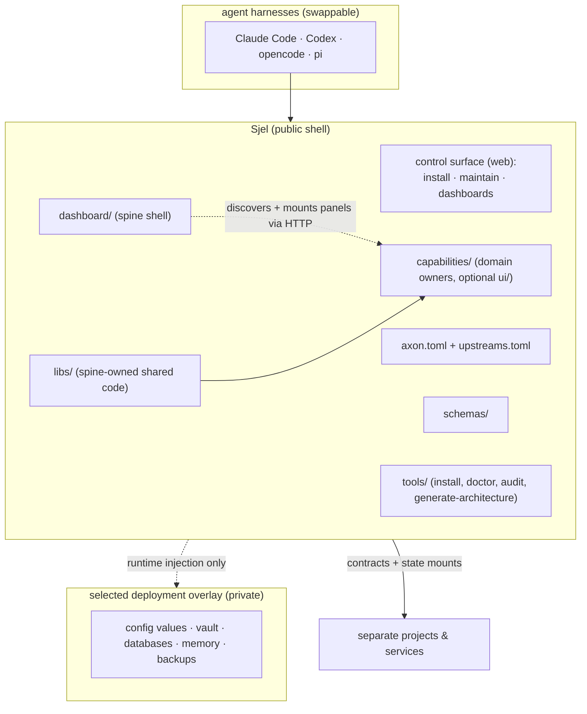

# Contributing to Sjel

Sjel accepts changes that improve the reusable public shell. Personal data and deployment state
stay in a private overlay. The same boundary covers credentials, private host details, and
operator-specific policy.

## Before writing code

Name the consumer and the outcome. An interesting technology without a concrete Sjel consumer
remains an idea, not an implementation commitment.

No backlog entry is required to start. Add a claim to the owning `ISA.md` only when something
must outlive the change itself: a defect being left unfixed, or a decision that needs a record.
Write it as a claim with the probe that would falsify it, not as a description. The issue tracker
takes reports from outside the project; it is not where this project's work is planned.

Before external code or adopted design influence enters the tree, record its canonical source in
`upstreams.toml`. Record the license and verdict there too, then state precisely what Sjel
adopts. No version: the register holds none since 2026-09-02, because every dependency tracks its
upstream's latest release (#patch-first).

## Work on one change

Start from current `main` and create a branch named for the change: `<area>-<short-slug>`. Keep
the diff inside one coherent boundary. Put reusable code and doctrine in Sjel; use synthetic fixtures for
data-shaped tests. Never copy an active overlay or secret value into public work. Workstation paths
and private logs must also stay out of commits and GitHub text, including screenshots and test
failures.

Run `tools/doctor` before editing and record unrelated or machine-only failures separately. A
fresh source checkout does not need a real private overlay for CI; repository tests use synthetic
configuration where a machine contract is required.

## Validate the changed boundary

Run the nearest tests and checks declared by the package you changed. Then inspect the focused
diff, `git diff --check`, and `git status --short` before committing. Common repository checks
are:

~~~sh
cargo test --workspace --locked
bun test
tools/check-publication-hygiene.sh
tools/isa-hygiene.sh
~~~

Rust packages are members of the root `Cargo.toml` workspace and share the
root `Cargo.lock`. Keep each package's direct dependencies in that package's
manifest; do not add a nested lockfile. For a Rust change, verify the workspace
view and the build:

~~~sh
cargo metadata --locked --no-deps --format-version 1
cargo fmt --all --check
cargo clippy --workspace --all-targets --all-features --locked -- -D warnings
cargo check --workspace --locked
cargo test --workspace --locked
~~~

Run the format and Clippy commands from the repository root. They use the channel and
components `rust-toolchain.toml` names -- `stable`, so the release rustup last fetched;
CI resolves the same file, not a literal held somewhere else. Do not replace a finding
with a workspace-wide allowance. A narrow allowance belongs beside the affected
item and must explain the invariant that makes the lint inapplicable.

That command needs no database service and no environment variable. The
database-backed suites are `db_tests::` — one module name across the workspace,
which is what makes them selectable — and each test opens a temp SQLite file of
its own. Run them alone with:

~~~sh
cargo test --workspace --locked -- db_tests::
~~~

Until PRD Q45 (2026-08-27) these suites needed a running Postgres and six
`*_TEST_DATABASE_URL` variables, so the hermetic command carried
`--skip postgres_tests::` and CI ran a second job with a service container.
Both are gone; a checkout with no overlay and no server runs everything.

Run `bun run check` in `dashboard/` when dashboard code changes. Manifest or
generated-architecture changes also require:

~~~sh
tools/generate-architecture.sh
tools/check-architecture-fresh.sh
~~~

Do not describe a skipped or unavailable check as passing.

**`SJEL_DB_PATH` isolates the database and nothing else.** It does not isolate a vault
projection. `capabilities/trips`' `project_after_write` runs as a router layer after any
successful non-GET request and takes its root from the overlay config, which that variable
never touches — so a live check on 2026-09-05 that redirected only the database passed every
assertion while re-exporting thirteen real plan notes into the operator's Obsidian vault and
creating a fourteenth. `finance` and `comms` project too. Before running a server against a
copy, export every projection root as well: `SJEL_TRIPS_OBSIDIAN_ROOT`,
`SJEL_FINANCE_OBSIDIAN_ROOT`, `SJEL_FINANCE_DECISIONS_ROOT`, and a scratch `SJEL_COMMS_CONFIG`
(comms resolves its config file from that variable, so a scratch file is what redirects it).
Overriding `SJEL_PERSONAL_ROOT` instead is not the fix: it redirects the config *read* too, so
the run tests a configuration nobody is operating.

**Do not `cargo build --release` in a worktree that shares the repository's `target/`.** That
build writes `target/release/<bin>`, which is the exact artifact the supervisor runs, and on
Apple Silicon a running process dies when its own binary changes underneath it. On 2026-09-05
a worktree release build therefore killed a live service, the supervisor restarted it from the
new artifact, and the branch's migration ran against the real database — leaving eight empty
tables no merged commit had put there. The build reported success and nothing anywhere
reported the restart. `tools/service-runner.sh`'s `maybe_build` is the function that makes the
artifact load-bearing. For a live check from a worktree, build a debug binary, run it on a free
port and point it at a copy; use a separate `CARGO_TARGET_DIR` if a release build is
unavoidable.

The same rule applies inside a test. An assertion that needs something only one platform has —
`/dev/full`, a container runtime, a specific filesystem — may be given up on a developer machine
and never in an automated run, where "it runs in CI" would otherwise be an assumption nobody can
see failing. Guard it with `skippable` from `tools/lib/test-support.sh`: outside CI it prints what
coverage was lost, and inside CI it fails.

## Open the pull request

Open a draft pull request first. State the outcome, then bound the exact scope. List every
completed validation command with its result and name the known limits. Keep separable follow-ups
out of the pull request rather than widening it. A merge should land one coherent change and
remain easy to review or revert.

Security findings follow [SECURITY.md](SECURITY.md); never report one in a public issue or pull
request.

## License and sign-off

The project is licensed under the GNU Affero General Public License, version 3 only
([LICENSE](LICENSE)). Anyone who runs a changed version as a service for other people must
offer those people its source. Code that `Packs/` vendors from other projects keeps its own
license; each such Pack reproduces the upstream notice in its `LICENSE` file.

Every commit carries a Developer Certificate of Origin sign-off
([developercertificate.org](https://developercertificate.org/)): a `Signed-off-by:` line that
states you have the right to submit the change under this license. `git commit -s` adds it.
A sign-off does not transfer copyright: a contributor keeps it in their change. A later license
change (README, open question O2) therefore needs the consent of every contributor whose code
remains, or a contributor license agreement introduced before outside contributions arrive.

Releases before 2026-09-26 were published under the MIT license and stay available under it.

---

# Engineering doctrine

The rules below govern every change to this repository. Each section is the owner of its rule; code
comments and capability READMEs link here.

## Product rules

Every change keeps to these. Rules 1, 4 and 5 describe the target behaviour; the README's
[State](README.md#state) table shows how much of it is built.

1. A task runs on the best model the device can reach: its own Apple model, then the Mac's, then
   deterministic rules. The result shows which one answered.
2. A paired device's key admits its requests. Every connection type carries the same signed
   requests.
3. Sjel detects what the devices can do and chooses the defaults. Other options are under
   Advanced.
4. C2 data leaves the owner's devices only end-to-end encrypted, with keys on those devices, or
   pseudonymized. A cloud request carries only the fields its task needs (Staab et al.); ambient
   metadata, protocol headers, and extraneous history are stripped. A test proves each path. A
   failing test closes the path.
5. Summaries and labels appear without a confirmation. Confirmations protect only while they are
   rare enough to be read (Akhawe and Felt); frequent prompts cause habituation and click-through.
   A reversible change applies by itself only after a frozen test set shows it is reliable. A change
   that leaves Sjel, or cannot be undone, asks. The prompt rate on routine flows is measured and
   kept at zero.
6. Screens and assistant tools come from the typed data.
7. A statement about the system cites the file, command or measurement that proves it.

## Start here

Sjel supports macOS and Linux. The guided installer detects the platform, creates or connects a
private deployment overlay, writes the local machine manifest, and leaves existing state alone.

~~~sh
git clone https://github.com/larsboes/Sjel.git
cd Sjel
tools/install.sh --help
tools/install.sh
tools/doctor
~~~

Read the prompt before choosing an overlay location or cloning a private remote. Missing host
tools are reported with platform-specific installation hints from `toolchain.toml`; the installer
does not hide or auto-install them. Contributors who only need the source and test suite can skip
the operating setup and start at [Before writing code](#before-writing-code).

## Operating values

These are design tests, not aspirations. A value only counts when it changes a placement,
contract, install, or review decision.

1. **Lean runtime, growing monorepo.** A fresh install enables a small useful core. The repo
   may hold far more — optional capabilities, Packs, public reference projects — and none of
   that may become a runtime prerequisite.
2. **One feed, many views.** Capabilities keep domain ownership, but publish typed events with
   provenance, time, confidence and state. The dashboard sorts and connects those events; it
   does not become another data silo.
3. **Data and mechanism never blur.** Sjel owns public code, schemas, renderers and explicitly
   public first-party datasets. The active private overlay owns private content, secrets, machine
   configuration and history. Both sides use the same bounded
   contracts: data may select an allow-listed behavior, never become executable code.
4. **Evidence before automation.** Every surfaced claim keeps its source, evidence boundary and
   decision state. Agents rank and explain; anything irreversible still goes through the
   capability contract, and leaves a trace.
5. **Security is continuous observation.** An audit gate is a start, never the property itself.
   Nothing here is held at a version any more: Q74 and Q77 (2026-09-02) removed the adoption
   cooldown and every `pin`, so a fix outside the npm ecosystem lands the day it exists and
   reporting stands where the hold stood ([Patch first](#patch-first)). Q109 (2026-09-22)
   restores a 24-hour resolution hold for Bun/npm packages only, because that registry's threat
   model is different; it is an age window, not a version pin. Egress, access and agent touches
   stay observable after install; their logs live privately.
6. **Replaceable edges, stable contracts.** Agent harnesses, model providers, visual renderers
   and deployment substrates are adapters. Adopt first and record why. Re-open the call when
   its stated flip condition comes true.
7. **Self-hosted by default, distributed when earned.** One home-server deployment should serve
   phone and desktop clients. Kubernetes, WASM or a native shell enter only for a measured
   portability, isolation or performance need.
8. **English is the shared surface.** Sjel-authored interfaces, documentation, prompts,
   summaries, explanations and errors default to English. Source material and explicitly
   locale-specific capabilities may remain multilingual; accepting multilingual input must not
   silently change Sjel's output language.

## Feed, Scouting, and Obsidian boundaries

“One feed” means one general observation stream, not one opportunity engine. A feed item is
anything the operator may need to notice: a security advisory, system or package update,
change in a watched repository, news item, useful article, scholarship, hackathon, event, or a
future source that fits the same typed observation contract. Each item keeps its source,
observed time, evidence link, kind and decision state. The originating capability keeps any
domain-specific payload.

`comms` currently supplies the feed store, manual link ingest and mail triage. Its present
extractors do not define the feed's future scope. Its first bounded recurring collectors are
GitHub Trending and configurable arXiv queries. A new source belongs in the general feed when
its first job is awareness or reading.

Mail triage has a second classification rung: a local model, run explicitly, over exactly the
threads the deterministic rules left at the conservative fallback (PRD Q85, 2026-09-05). It reads
the sender's domain, the already-redacted subject and the already-redacted preview, refuses a
Secret mail before a prompt is built, and never leaves the machine. It ships in shadow: it stores
a verdict beside the rule's and moves no category until a frozen labelled corpus has been
measured and the overlay declares it. Even then it never raises a mail's data class, because
that write is irreversible on two axes, so a proposal that would raise it is held for a person.

Personal relevance is a Feed annotation, not a new ownership boundary. Comms scores an item
against explicitly configured TELOS focus notes, stores the matches separately from the item
and labels whether the comparison was semantic or a lexical fallback. The dashboard can sort
by a revisioned deterministic evaluation whose visible factors cover TELOS fit, upcoming
travel, freshness, content basis, and — once it has enough evidence to be worth anything — what
the operator's own keeps and dismissals imply (PRD Q88, 2026-09-05). That fifth factor is learned
from an append-only interaction ledger, is capped at fifteen points of a hundred, and never
writes a decision of its own. What must be re-embedded and what must merely be re-ranked are two
separate revisions, so a changed ranking input re-evaluates from stored matches instead of
calling a model again. Mail is evaluated the same way, on its own factors, and publishes one
score (PRD Q89). `/feed/[id]` remains one dynamic reader for every item instead of generating
one application page per link.

The dashboard shows passive intake and active discovery as two views of one `/feed` workspace.
That is a UI integration and never a database merge: each capability keeps its own contract and
provenance, and `dashboard/README.md` owns which view calls which.

Narrower by design, `scouting` searches for and scores opportunities such as
scholarships, hackathons, events, calls for papers or travel deals against an interest
profile. It may accept a feed item as a candidate and may publish a scored result back to the
feed, but it does not own security updates, system changes, watched repositories, general news
or interesting articles. Those remain valid feed items without ever entering Scouting.

Obsidian is an external personal writing surface, not a second Sjel-wide database. Each
capability owns its own explicit vault contract: `comms` can discover links only in configured
exact notes or headings and can export a distilled keeper, `scouting` can read typed
opportunity notes and link matches, and `trips` can import or later synchronize trip plans.
Each capability's README states what its own scan reads and what it refuses. These integrations
may share schemas and source references, but one must never scan or rewrite another
capability's notes by implication.

The harness-swappable, public-core-plus-private-overlay shape isn't invented from nothing. It
descends from Daniel Miessler's [LifeOS](https://github.com/danielmiessler/LifeOS), the upstream
AI-operator project. Sjel carried a reviewed delta against a LifeOS installation until
2026-08-25, when that delta and its sync tooling were deleted; the shape it taught stayed. See
`upstreams.toml`'s `[lifeos]` entry for what was consumed and why it stopped.

## Architecture and ownership

### Public core and private overlays

Sjel contains everything that can be public. Private data, vault contents, backups and deployment
configuration live in one selected overlay. A host, residence or user account is not automatically
a repository boundary: split overlays only when their trust, lifecycle or ownership genuinely
cannot be managed together. Access control belongs at the service and data-contract boundary.

Nothing private or secret enters this repository. Explicitly published work and its reviewed
public data may; unreviewed personal material may not. This is a commit-level property, not a
cleanup step before release.

"Private" is not only about values. A set of entries can identify a place or a person while
every single one of them is harmless on its own: which third-party integrations a deployment
consumes, which automations it has, which services it runs. Each one points at a public
repository and each template holds nothing but placeholders, and the list still describes the
hardware in one building. Filenames do it too, with no value in them at all. So a capability
here keeps the mechanism — how a service runs, how templates are filled, how upstreams are
audited — while the selected overlay keeps the inventory of what a particular
installation actually has. `tools/check-publication-hygiene.sh` catches repository names and
workstation paths; it cannot see aggregation, which is why this is a rule rather than a gate.
`tools/isa-hygiene.sh` is the advisory companion: it sweeps the tracked `ISA.md` files for
volume names, hostnames, private addresses and uncommon path roots, and reports rather than
fails, because an ISA is an evidence log and whether a given measurement may be published is
the operator's judgement. Set `SJEL_PRIVATE_NAMES` to this machine's volume and drive labels —
the overlay owns them — so a bare backticked label is caught too.

### What the installer owns in an agent harness

`~/.claude` belongs to its operator, not to Sjel, and the installer's authority over it stops at an
additive merge of a baseline Sjel owns, plus offers. Stated here because the discipline was already
implemented in three separate tools and written down in none, which is the shape a boundary erodes
in.

`tools/claude-code-config/claude-code-config` is the one write that happens without being asked, on every install
including a non-interactive one. It merges the USER layer into `settings.json` with existing keys
winning, so it can add a default and can never remove or overwrite one the operator set, and it
refuses to touch a `settings.json` it cannot parse rather than replacing it. There is no MANAGED
layer: the principal retired it on 2026-10-02, after asking what it bought against what it cost
— sudo on every device for every change, and an MCP allowlist that had quietly blocked a server
this machine had configured. The floor now lands in the same user-level file, which is why the
merge rules above matter more than they did: they are what makes the write additive over a file
that also holds the operator's own decisions. What the retirement gave up is that the floor is
now editable by the agent sessions that run as that operator; `sjel claude check` reports drift
instead, because a policy that arrives unasked is still not one anybody chose, but a policy
nobody can re-read is not one they can maintain either.

Nothing else writes unasked. The installer lists Packs and prints the activation command; it never
links one. Agent-harness integrations are read for status, then installed only behind a TTY and an
explicit prompt that defaults to no. Every destination is a default rather than an assumption:
`CLAUDE_CONFIG_DIR`, `CLAUDE_SKILLS_DIR` and `CLAUDE_AGENTS_DIR` move them, and a harness that is
not present is reported and skipped.

### Integrate-first topology

A personal or self-authored project folds into Sjel by default. It stays separate only when it has
an independent product identity, a device-sync lifecycle of its own, collaborators, or is itself
an overlay. Separate projects integrate through declared contracts and state mounts. They are
never left as invisible local dependencies. The overlay relationship recurses: a capability with
more than one non-interchangeable deployment still gets exactly one shared pattern in Sjel, and
several hosts may consume one overlay when they form one operational trust boundary.

Base-plus-plugin and repository topology are separate decisions. The base defines contracts and
extensions implement them; integrate-first decides where a project lives. Neither implies the
other.

### Three architectural nouns

Sjel uses three nouns and no residual category:

- **Spine** is the fresh-install core: root manifests, `schemas/`, `tools/`, `libs/` and the
  `dashboard/` shell. There is no literal `spine/` directory.
- **Capability** owns a bounded domain, external system or data store under
  `capabilities/<name>/`, whether or not it has a container or another capability consumes it.
- **Pack** holds public agent know-how under `Packs/` and drives capabilities through their
  contracts.

Shared code with no domain belongs in `libs/`; shared contracts belong in `schemas/`; operator
machinery belongs in `tools/`. If a piece fits none of them, its boundary is wrong. Do not create
`utils/`, a fourth top-level noun, or a parent directory grouping capabilities merely because they
run on the same host.

### Schemas and dependency direction

`schemas/` is law: import shared contracts, never redefine them. Compile-time dependencies point
downward from capability to spine. A capability that needs another service declares
`requires = [...]` and uses its HTTP surface and schema, never its implementation. Promote code to
`libs/` at the second real consumer, provided it owns no domain of its own.

The dashboard is presentation only. It discovers and mounts capability surfaces but owns no
domain state or business logic. A UI serving one capability lives under that capability and
arrives or leaves with it.

## Dependencies and build

### Upstream-first

Choose in this order: adopt, contribute upstream, overlay a pinned source, use a fork only as a
temporary contribution vehicle, then build. A maintained fork is another copy of the same logic
and drifts for the same reason duplicated configuration does.

### Cargo and bun are the build path

`cargo` builds and tests the Rust workspace: one root workspace, one `Cargo.lock`, and each member
manifest owning its own direct dependencies. A service manifest names its `target/release` binary,
and `tools/service-runner.sh` builds that binary on demand. `bun` owns TypeScript and the UI
bundles. Generated-architecture freshness is a script gate, `tools/check-architecture-fresh.sh`,
not a build-graph target. PRD Q44 (2026-08-25) decided this and retired the Bazel graph that held
the same jobs before it.

A tool may be a Cargo member too. `tools/storage` is one: generalized operator tooling is built
in Rust before shell, before Python, before TypeScript, and the placement guide already sends
operator machinery to `tools/`. Its launcher builds the release binary on demand, the same
on-demand build `tools/service-runner.sh` does from a service manifest.

Existing scripts move into one crate, `tools/sjel-cli`, rather than one crate each, so that
repository, overlay and manifest resolution are written once (decided 2026-10-02). A moved
script keeps its path as a launcher that calls `sjel_cli_exec` from `tools/lib/sjel-cli.sh`, so
its callers do not change. `tools/toolchain-check` was the first, then `sjel` itself,
`tools/capability.sh`, `tools/service-runner.sh` and `tools/doctor`, and then `tools/harnesses`
(the read verbs on 2026-10-02, `sync`/`use`/`promote`/`accept` with the pack-deploy mutation
engine and pi's settings registry on 2026-10-04), and then `tools/updates` (2026-10-04), and
then the four `packs-*` adapters with `tools/pack-drift-hook` (2026-10-04, which is what let
`tools/lib/pack-deploy.ts` and `tools/lib/harness-registry.ts` be deleted — the engine had been
Rust since 2026-10-02 and the adapters were its last reason to exist in two languages), and then
`tools/self` with `tools/lib/self-model.ts` (2026-10-04, which the doctor runs on every
invocation), and then `tools/audit` (2026-10-04 — `sjel update apply` runs it, and `tools/doctor`
reads the verdict its exit code leaves in the host-patch receipt), and then `tools/host-watch`
with its test (2026-10-04, which is what let the hourly job stop starting an interpreter. It is
also the first tool in this crate to open the shared store, so that crate now links
`libs/sjel-store` — and `libs/sjel-config` with it, because the database path has one owner and
it is not this one), and then `tools/feed-sweep` and `tools/sparpreis-watch` (2026-10-04, the last
two `bun run` jobs in the repository: both manifests now name the built binary with a `build`
line, so no timer starts an interpreter — which is also what took `sjel-http` and `sjel-server`
into this crate, the one client factory and the one inbound-credential helper), and then
`tools/model-check` (2026-10-04, which is what stopped `tools/doctor` starting an interpreter: it
ran `bun tools/model-check.ts --local --json` on every invocation and that leg was 6.9 s of the
doctor's 20.6 s, which fell to 11.8 s once the doctor called the same crate in-process).
`tools/sjel-mcp.ts` is the one exception and not a second crate: the `tools/sjel-mcp` crate
already held its registration half, so the server moved in beside it on 2026-10-04 rather than
into `sjel-cli` and a second MCP implementation.
Because of this, `cargo` is a core host
requirement in `toolchain.toml`, together with `rg` and `fd`.

Any build layer above those two is argued per case, never assumed. Name what it buys and what
toolchain cost it adds. `tools/doctor` stayed an interpreted command until 2026-10-02, on the
argument that wrapping it would add machinery without improving correctness. It moved into
`tools/sjel-cli` with the rest of the tooling once that machinery existed for other reasons, and
the move paid for itself on a measurement: the doctor spends its time waiting on the tools it
delegates to, and the Rust version runs independent sections at once (26 s to 16 s on the build
host, the same report line for line). The dashboard build was deliberately reopened when
production began consuming capability-owned UI bundles; its README records that trigger.

Build artifacts are not state. `sjel storage target` measures `target/` per profile and per
bucket and checks PRD §9's R6 — `target/debug` may not exceed `target/release` by more than 3× —
and `tools/doctor` reports the verdict. `sjel storage prune` gives the space back:
`--incremental` for the cache that always regrows, `--target` for a `cargo clean`, and
`--node-modules` for every ignored `node_modules`, `.svelte-kit` and `dist` in the checkout. The
`[profile.dev.package."*"]` stanza in the root `Cargo.toml` is the measurement that produced the
rule; its comment states what it trades.

### Implementation languages and intelligence

New backend logic defaults to Rust. Choose the lowest rung that can solve the problem and justify
every move upward: heuristic, algorithm, classical machine learning, local AI, cloud AI. A model is
not a substitute for a deterministic baseline it has not beaten.

### One manifest per concern

Configuration has one owner per concern:

| Manifest | Owns |
| --- | --- |
| `axon.toml` | Shared platform defaults and the shipped overlay fallback; never machine-specific state |
| `axon.local.toml` | This checkout's active overlay location; gitignored and written by the installer |
| `upstreams.toml` | External code and adopted influence: url, verdict, license and why. No version — every entry tracks its upstream's latest |
| `toolchain.toml` | Host executables Sjel commands assume, with requiredness, scope and install hints |
| `systems.toml` | Systems, services and projects that have a role in the setup |
| `<overlay>/config/machine.toml` | OS, container runtime, enabled capabilities and state mounts for this machine. An overlay owning several machines uses `<overlay>/config/machines/<name>.toml` instead, selected by `axon.local.toml` or the hostname |
| `<overlay>/config/deployment.env` | facts true of the whole deployment rather than one machine or one capability — the home timezone, and `SJEL_INBOUND_TOKEN_FILE`, the reference to the shared secret every capability server authenticates inbound requests against (`libs/sjel-server/README.md`). Declared once because several capabilities need it and independent copies drift silently (`schemas/deployment.env.example`) |

`tools/lib/toml.sh` is the parser for single-line scalar and array fields. More complex TOML goes
through the shared Bun parser; no caller grows another partial parser or duplicates manifest data.
Event sources follow the same pattern: declared configuration, never values spread through code.

Host requirements are scoped, not global. `toolchain.toml`'s `needed_by` says where an entry
applies: absent means every machine, `workflow:<name>` means only when that workflow is asked
about, and `capability-field:<field>` derives from the enabled set so the requirement follows the
capability when it moves host. A runtime node is therefore never told to install a scanner it has
no path to invoke, and a tool that is out of scope is reported as `n/a` naming what would pull it
in rather than omitted. Run the scoped check after changing what a machine is enabled to do, and
run it for a workflow before invoking one:

```sh
tools/toolchain-check                    # this machine: core + enabled capabilities + runtime
tools/toolchain-check --workflow restore # before a restore, not after it holds a service down
```

### State mounts record reality

Sjel does not relocate an adopted tool's data directory. The active machine manifest records where
the tool really persists data, its class, sync policy and direction. Backup and monitoring walk
that registry. Dotfiles and shell configuration are state mounts with injection direction, not
special cases.

## Security and data

### Dependency verdicts and provenance

Every consumed external dependency gets a verdict in `upstreams.toml` first. **No entry, no
entry.** The manifest records, per upstream, the URL, the verdict, the licence and the `why` that
argues for it — four fields and nothing else. The consuming README also records what Sjel
adopted: runtime, idea, architecture, algorithm, code or asset. A local clone or archive path is
never durable provenance.

**The register records no version.** `pin` stood on 86 rows until 2026-09-02, when Q77
deleted it. Every dependency here tracks its upstream's latest release, and the field had stopped
describing anything a machine was running: `capabilities/host-patch` moves brew, uv and rustup
nightly, `capabilities/container-refresh` moves the images daily, Dependabot moves the Cargo and
Bun manifests, and both workflows install `latest`. What it actually recorded was the date an
audit was written, which is a fact that belongs in the `why` where it cannot be mistaken for a
claim about a host. Deleted lines stay in the manifest's git history.

What changed on 2026-09-02 (Q74, then Q77) is who checks what, and how fast a fix lands. What
is required — a verdict, a licence and an argument, before consumption — is unchanged.

| Question | Answered by |
|---|---|
| Is there a verdict, a licence and a reason? | `upstreams.toml` itself, read by a human at review time |
| Is a newer release out? | Dependabot version updates — `.github/dependabot.yml`, one grouped pull request per ecosystem per day; Cargo/actions use 0 days, Bun uses the Q109 one-day window |
| Is a locked dependency known-vulnerable? | Dependabot alerts and security updates, and `osv-scanner` in `.github/workflows/security.yml` and in `tools/audit` |
| Is software installed outside this checkout known-vulnerable? | `tools/audit`'s second `osv-scanner` pass: the full global npm tree as a CycloneDX SBOM, plus each installed crate's own published `Cargo.lock` (the resolution `cargo install --locked` uses). Nothing else covers it — Dependabot reads lockfiles in this repository, and `osv-scanner`'s `directory` plugin extracts nothing from installed software on this host (measured 2026-10-03 on 2.6.0) |
| Is there a CVE in a declared capability image? | `grype registry:<image>:<tag>` in `security.yml`, weekly. Findings are report-only and land in the run summary; the job goes red only if it discovered no image to scan. No container runtime and no local pull |
| Is there a secret in this repository? | GitHub secret scanning, with push protection — and `gitleaks` in `tools/audit`, which reads history the push protection never saw |
| Is there a secret in the private overlay? | `tools/audit` alone. GitHub charges for secret scanning on a private repository, and this repository's CI cannot reach the overlay, so this is the one scan that has to be local |
| Is there a flaw in the code as written? | CodeQL — `.github/workflows/codeql.yml`, `security-extended` over rust, javascript-typescript, python and actions |
| Is a host package behind? | `sjel update` — every class of software installed outside this checkout, with the owner of each named and the stale ones listed. `capabilities/host-patch` moves `brew`, `uv` and `rustup` daily; `sjel update apply` moves the two classes nothing else owns (`cargo install`ed crates, global npm packages) |
| Is a running container behind its channel? | Nothing asks. `capabilities/container-refresh` pulls every declared image every day and recreates what moved |

`upstreams.toml` is documentation, and only documentation. Nothing enforces its fields, and since
Q77 no script reads one: `tools/agent-integrations.sh` drove an upstream's own installer at a
recorded version and now takes its latest, `tools/sysmon` printed a recorded version in its
install advice and now names none, and `tools/self` publishes name and verdict into
`self.json`. A human reads a verdict before adopting a dependency, which was always the actual
rule.

`pin_kind`, `tracked_by` and `installed_probe` were deleted on 2026-09-02 under Q74. Each existed
to describe an opt-out from `renovate.json5`'s release watch, and that file went with the
cooldown. `installed_probe` named how to ask *this* machine what it really has, and under
patch-first the answer is "whatever brew installed last night" — the question stops being askable
rather than stopping being asked.

**Two gaps, named rather than left to be inferred from a green check.** Shell is scanned by
nothing: CodeQL has no shell extractor, `semgrep` was retired with the rest of the set, and
0.44 MB of `tools/` is the largest hand-written surface here. A malicious release is not
covered uniformly: Q109 adds Socket's scanner to the two Bun UI trees, while every other
install path relies on its own ecosystem controls, lifecycle-hook blocking where Bun applies,
and the observation that happens outside this repository. The scanner is network-backed and its free mode is not a
substitute for that hold — see [Patch first](#patch-first) for the trade.

### Patch first

This section was **Pins and cooldown** until 2026-09-02, and an `upstreams.toml` entry dated
before then was decided under the hold it described. Those entries still point here; their text is
left as written, because rewriting a decision's reasoning to match a later rule falsifies it.

Take the patch. There is no adoption cooldown on host packages, Cargo, containers, rustup or
repository-wide version policy, and nothing is held at a version anywhere. Q74 removed the
cooldown on 2026-09-02; Q77, the same day, removed what was left — `upstreams.toml`'s 86 `pin`
lines, the Rust toolchain literal, the three container image versions, and
`capabilities/agentbox`'s pinned release and checksums. Q109 (2026-09-22) is the narrow
exception: Bun/npm resolution waits 24 hours in the two UI trees and on this laptop, while
Dependabot applies the same one-day window to those two manifests. The laptop-wide copy is
`~/.bunfig.toml`; `tools/install.sh` offers it opt-in and `tools/doctor` reports drift. It is an
age hold, not a version pin, and every dependency still tracks its upstream's latest after that
window.

The hold asked a release to age seven to fourteen days before adoption, on the argument that the
ecosystem finds a compromised publish in days and reading the dependency tree yourself cannot.
That argument is still true, and it was traded away deliberately. The same window that catches a
poisoned release also holds every ordinary security fix, and this deployment has one operator: a
hold that needs a human to end it is a hold that ends late. What was measured on the day of the
ruling is why the trade is defensible rather than merely chosen — Homebrew formulae sat outdated
with no updater configured at all, `openssl@3`, `gnupg`, `libgcrypt`, `nss` and `ffmpeg` among
them, while the bot that was to enforce the hold had never been installed. The hold was guarding a
door that was already open.

**What replaces it is speed and reporting, not silence.** Four things move on their own, and each
one leaves something a check can read:

- `capabilities/host-patch` runs `tools/host-patch.sh` every 24 hours — `brew update`, `brew
  upgrade --formula`, `brew upgrade --cask --greedy`, `brew cleanup`, one `uv tool upgrade` per
  installed tool, `rustup update`, then `tools/audit`.
- `capabilities/container-refresh` runs `tools/container-refresh.sh` every 24 hours on a host
  that runs containers: it pulls every image a `service.toml` declares and recreates the ones
  whose digest moved.
- `.github/dependabot.yml` opens the repository half daily. Cargo and github-actions carry
  `cooldown: default-days: 0`; the two Bun manifests carry `default-days: 1`, the 24-hour npm
  window restored by Q109. `.github/workflows/dependabot-automerge.yml` still arms
  `gh pr merge --auto --squash` on each pull request — so the ordinary bump merges itself once
  the required checks pass, and no bump waits for somebody to look.
- `rust-toolchain.toml` names the `stable` channel rather than a release, which is the toolchain
  `rustup update` above already installs.

Both scheduled jobs write a receipt the next `tools/doctor` reads out, because a scheduled job's
real failure is that it quietly stops running. `.github/workflows/security.yml`, CodeQL and
GitHub's advisory alerts are what now stand between a bad publish and this machine.

**The named cost.** A compromised publish reaches the npm path after one day instead of after a
seven-day hold; host packages and the other ecosystems still take the patch immediately. The two
Bun UI trees now add Socket's scanner, but it is a network-backed detector rather than a guarantee:
free mode needs no token, a Socket outage is an operational dependency, and the scanner does not
cover non-Bun paths. What stands against the remaining gap is smallness and reading — every entry
in `upstreams.toml` carries a human verdict, every resolving UI tree carries the hold and scanner,
and `bun install` never runs a lifecycle hook (`tools/check-bun-install-policy.sh`), which is the
path ChainDrop took.

**The second cost, from dropping the versions.** A merely BAD release now lands too. A broken
`graphify` breaks `tools/graphify.sh` the day it ships, a bad Home Assistant `:stable` is what
the house runs by the next morning, and CI can go red for a Bun release nobody here chose. That
is the trade, not an oversight: a version literal bought a delay and, on this deployment, delay
was measured to be the more expensive failure. It also never bought reproducibility — a container
tag is rebuilt under the same name, and `upstreams.toml`'s `pin` recorded an audit date while
`host-patch` moved the installed version past it every night.

**Where the version actually lives now.** Not in a manifest. The digest of a running container
(`docker inspect <name> --format '{{.Image}}'`, ISA.md C4), the label on a built agentbox image,
`Cargo.lock` and `bun.lock` for what is compiled, and `<overlay>/data/*/last.json` for what the
last scheduled run did. Every one of those describes a machine rather than an intention.
`toolchain.toml`'s `min_version` rows are the exception that proves the rule: they are FLOORS —
the oldest release Sjel's use of a tool is known to work on — and never a version to install.

**One binary, one owner.** On macOS `brew` owns `bun`, `uv`, `gitleaks` and `osv-scanner`, so
`host-patch.sh` never calls `bun upgrade` or `uv self update`. A second updater for one file is
how a `~/.local/bin` copy comes to shadow the `brew` one and answer differently — the PRD records
that happening to `yt-dlp`, which returned HTTP 403 on every media URL while `--dump-json` kept
working.

**Container images track a channel.** A `service.toml` `tag` names the publisher's rolling tag —
`:stable` for Home Assistant, `:latest` for Pi-hole, `:alpine` for Vaultwarden — and
`capabilities/container-refresh` pulls every declared image every 24 hours, recreating the
container when the digest moves. `tools/check-service-tomls.sh` refused `latest` until 2026-09-02;
it was defending a reproducibility a tag never gave, since publishers rebuild under the same
literal. The digest is what identifies a running image (ISA.md C4).

**The Bun the workflows install is `latest`.** `oven-sh/setup-bun` is asked for `bun-version:
latest` in both workflows, so CI runs the runtime a contributor's package manager just gave them.
It was three pinned literals and `tools/check-bun-pin.sh` keeping them equal until 2026-09-02; with
no literal left anywhere — not in a workflow, and since Q77 not in `upstreams.toml` either —
there is nothing to diverge, and the class that gate caught is impossible rather than watched. The
cost is stated rather than hidden: a bad Bun release can turn CI red for a reason
unrelated to the code, which is the same trade `security.yml` makes for its scanners.

**`capabilities/agentbox` builds from the latest release.** `agentbox build` and `agentbox
host-install` resolve GitHub's `/releases/latest` and verify the tarball against THAT release's
own published `SHA256SUMS` — so the sha256 refusal survives, and the version and checksum
literals it used to compare against are gone. The self-update shim went with them: it refused
`pi update` to protect a pin, and with no pin it would refuse the outcome this section asks for.
The cooldown half, and the separate `gate` verb that was left holding only it, are gone. The
printed advisory reminder stays, because nothing automated reads advisories for a release tarball.

### Secrets

Secret values live in Vaultwarden, never in this repository or an overlay note. A capability may
materialize a real value only into its gitignored runtime environment because the service consumes
plaintext environment variables. Creating or changing one requires the user to run
`tools/setup-secret.sh` interactively after explicit, specific approval. A general “continue” is
not authorization. A pre-Vaultwarden bootstrap exception must be argued when a real need exists;
none exists today.

### Data classes

The data classes are `c0` Public, `c1` Mine, `c2` Others, `c3` Secret, ranked in that order. `c0`
and `c1` may reach a cloud model (`c1` only as a redacted derivative); `c2` and `c3` redact before
persistence and never reach a cloud model.

The policy is one function: `content_item::cloud_admission` in `libs/content-item`, a leaf crate
every capability already depends on. It admits two representations — `c0` unchanged to any declared
tier, and `c1` as a reviewed `c1` derivative to the `pseudonymized_personal` tier — and refuses
everything else, including every class outside the vocabulary. The `processing_policy` a reader is
shown is *derived* from it, so the label and the gate cannot disagree; they used to be two
expressions and did.

Enforced today, mechanically, on four independent gates: `cloud_derivative::prepare` builds no
approvable preview for anything that is not `c0` or `c1`, `cloud_derivative::tier_allows` (a thin
wrapper over `cloud_admission` that adds the transformation-version pin) refuses the dispatch,
dispatch re-reads the source row's **current** class so a derivative approved at `c1` stops
dispatching once the row becomes `c2`, and the `comms_content_cloud_derivatives` CHECK constraint
refuses the row.

`c3` is refused every local prompt too, and that is now a gate rather than a declaration:
`content_item::local_prompt_allowed` answers `false` for `c3` and for any unrecognized value, both
prompt-builders that read stored text ask it before they build a prompt —
`capabilities/comms/src/digest.rs` (digest, diagram and chart) and `capabilities/comms/src/media.rs`
(`summarize`) — and `processing_policy(..).local_processing` is derived from the same function. A
refused item gets a `local_refused` row that says so, not a missing one. Embed and rerank
(`libs/inference`) stay class-blind and loopback-or-nothing.

A refusal is missing evidence, never a free pass. A ranker that redistributes a refused factor's
weight over the surviving factors promotes exactly what the gate refused, so the refused share is
withheld instead and the weights sum below 1.0 on purpose (PRD Q89, 2026-09-05; measured on the
mail band in `capabilities/comms/README.md`).

Data may select an allow-listed behavior but may not become executable code.

### Backups before migrations

No data migration starts without a tested 3-2-1 backup. A command being reversible in source
control does not make its state mutation reversible.

`tools/backup.sh <capability>` writes a self-describing archive, ships it under a partial name,
verifies the remote byte count before renaming it, applies the capability's retention policy, and
records the archive size and SHA-256 in the private receipt. The receipt also records whether
retention ran. A shipment receipt proves delivery, not recovery.

For a recovery rehearsal, run `tools/backup.sh --no-prune <capability>`. This mode ships and
verifies a new archive but does not list or delete older archives. A capability that declares
`backup_sqlite` stays held while all declared host paths and the cold database copy are staged and
the staged copy passes `integrity_check`; it resumes before compression or network access. Failure
or interruption after the hold triggers a resume attempt and exits without shipping the staged
snapshot. A capability that declares `backup_sqlite_online` instead is never held: its database is
copied open, through `sqlite3 .backup`, and the archive records how many tables and rows the copy
held so a restore can check that they came back. That form is correct only where every reader is a
host process on this machine, which is the condition SQLite's WAL states and a container behind a
virtiofs mount does not meet.

Retrieve that new archive into a private scratch location, compare its SHA-256 with the receipt,
then run `tools/restore.sh <capability> <archive> --receipt <receipt.json>`. The explicit receipt
makes the command reject the wrong capability, archive name, byte count or SHA-256 before
extraction. Restore defaults to a new `/tmp` directory and refuses the Sjel checkout or active
overlay as a destination. It separates the recovery stages explicitly:

1. **Retrieve:** copy the named archive from the backup target without applying it.
2. **Extract:** validate archive structure and capability identity, then extract into isolation.
3. **Restore:** expand container-path archives with their recorded modes.
4. **Verify:** require declared roots, run SQLite integrity checking on every declared database,
   and compare an online copy's table and row counts against the numbers the archive recorded.
5. **Clean up:** inspect and then remove the retained scratch tree manually. The tool never
   removes the extracted evidence.

The rehearsal ends in that isolated scratch tree. It never applies recovered files to the live
overlay or starts a restored service against live paths. Any live replacement is a separate,
explicitly approved migration after the recovery evidence has been reviewed.

For a container-path backup, the nested tar remains the ownership and mode authority. Inspect it
with `tar -tvzf <restore-dir>/container-*.tar.gz`; the convenience extraction preserves modes, but
an unprivileged host user cannot re-apply a container's numeric ownership. Apply that archive only
inside the intended disposable or stopped container after the verification pass.

Archives created before the embedded `axon-backup.toml` format require `--allow-legacy`. That mode
uses the standard archive name and current manifest as weaker identity evidence, so it is for a
known private receipt, not an arbitrary file. Actual restore timestamps, digests, application-level
queries and verdicts stay in the private overlay; only a redacted pass/fail result belongs in a
public issue.

Security continues after install: egress, access and agent touches remain observable, while the
logs themselves stay in the private overlay.

## Tooling conventions

### Portable shell

Shell scripts remain compatible with macOS Bash 3.2. Do not use associative arrays, `mapfile`,
`readarray` or another Bash 4-only feature unless the script owns and verifies a newer runtime.

### Language tooling

Use `uv` for Python and `bun` for TypeScript. Do not add `pip`, `npm` or bare `node` commands to
Sjel code, launchers or documentation. The runtime choice belongs in `toolchain.toml`; an external
package consumed as code also belongs in `upstreams.toml`.

### Capabilities are data

A container-backed capability is a `service.toml` consumed by the shared service runner and
watchdog, not a new lifecycle script. Before adding a command, ask whether the behavior belongs in
the manifest. A user-facing command shipped by one capability lives with and is named after that
capability; implementation helpers stay off `PATH`.

### Dynamic paths and current facts

Resolve repository, overlay and platform facts through `tools/lib/paths.sh` and
`tools/lib/platform.sh`. Do not duplicate absolute paths or personal directory names. The only
unavoidable bootstrap is the initial `SJEL_ROOT` shell setting before any shared resolver can be
found.

Ports, enabled capabilities, health, issue state, test counts, graph size and machine state come
from manifests and tools at runtime. Prose may keep historical measurements and constants that are
part of an argument, but it must not claim a changing count that no gate verifies.

### Public CLI

`axon` is the public command interface for humans and agents. Run `sjel help` to discover
operations and `sjel search <task>` to narrow the current capability and Pack surface without an
installed agent skill. Repository policy lives in `AGENTS.md`; command help and capability or Pack
contracts own operational detail.

There is deliberately no separate CLI reference. `docs/axon-cli.md` was one, and every row of it
restated something `sjel help` already prints — a command table, the harness names, the discovery
instruction `AGENTS.md` carries verbatim. A second copy of a generated surface is the kind of doc
that rots first and is believed longest. `tools/install.sh` owns the installation contract: it
links `~/.local/bin/axon` to the tracked launcher, never overwrites a non-Sjel command at that
path, and reports the exact shell-path action when `~/.local/bin` is absent from `PATH`.

## Releases

### The release line

The public spine versions with SemVer, not CalVer. A tag is `vMAJOR.MINOR.PATCH` with all three
components present — `tools/release` refuses any other shape — and `tools/lib/version.sh` orders
tags with `sort -V`.

- **major** — a public contract or architectural shape changes such that an existing overlay needs
  edits to keep working.
- **minor** — a capability or operator-visible feature lands.
- **patch** — fixes only.

Judge a change against those three before opening a pull request. A contract change that ships as a
patch is what breaks an overlay on an update it was told was safe.

Deployment overlays stay untagged. An overlay is deployment state rather than a public release
line, and its commit identity stays independent of the Sjel version it runs against.

### Cutting and consuming a release

Tags are created through `tools/release`, never by hand. It gates on a clean tree, on `main`, not
behind `origin/main`, and a passing `tools/doctor`, then generates notes from the manifest-aware
delta in `tools/lib/delta.sh` — the same view `tools/update.sh` shows a consumer, so release notes
and the incoming preview cannot drift apart.

A checkout moves along the line with `tools/update.sh`: fetch, fast-forward, re-run `tools/doctor`.
It never resets, rebases or force-pushes; a checkout that is both ahead and behind is left alone
with instructions rather than silently repaired.

### Getting onto the line

The decided shape is one command that fetches a bootstrap script, which clones and then hands off
to the unchanged `tools/install.sh`. A usage install takes `--depth 1 --branch <tag>`; a
development install takes a full clone. The operator never types `git clone`. That bootstrap is not
written yet — `## Start here` shows the clone that works today — so what follows is the decision,
recorded because the two alternatives were rejected on evidence and should not be reopened without
new evidence.

A shallow usage install is not a dead end: `git fetch --unshallow` promotes it to a development one
without reinstalling. The tree exists either way, because it has to — every tool resolves
`SJEL_ROOT` from its own location, and no shape of Sjel runs without a directory tree.

**A release tarball instead of a clone was rejected.** Measured at decision time, a `--depth 1`
clone transferred 3.12 MiB and landed 11.4 MB in 586 files — most of that weight a lockfile the
build has since dropped, so the tree is smaller now, not larger. A tarball saves nothing measurable
and costs the update path: `tools/update.sh` is fetch plus fast-forward, so a tarball install would
need a second update mechanism for the same job.

**An install without git at all was rejected.** `git` is already a declared host requirement in
`toolchain.toml`, so skipping it removes no dependency and only removes capability. The run path
would survive — `capability.sh`, `service-runner.sh`, `watchdog.sh` and `packs.sh` make zero git
calls — but `tools/doctor` makes thirteen that carry weight, and `tools/update.sh` and `tools/self`
lose the update path and version truth entirely. Sjel's version identity *is* the release tag, so a
git-free install would need a stamped version file, a second source for one fact, plus a second
update mechanism: extracting over an existing tree leaves behind files upstream deleted. New
evidence would be git ceasing to be a host requirement, or the run path growing a consumer that
cannot assume it.

The agent-readable install page is the primary route and the one-liner is the terminal alternative.
Sjel's install contains real decisions — overlay location, container runtime, capability selection,
secrets — and an agent walking those with a permission gate per step beats a script asking the same
questions blind. Both land in the same `tools/install.sh` prompts.

## Packs and agent harnesses

### Harness-neutral Packs

`Packs/<name>/pack.toml` plus `skills/` is the neutral source for a togglable agent bundle. Harness
adapters translate that source into their own installation format; harness-specific metadata never
changes the neutral manifest or forks the canonical `SKILL.md`.

### Public skills

Skills stay public and contain no host, IP address, key, personal path or private preset. They
resolve instance values from the active overlay at runtime.

### Skills drive capabilities

A skill is a thin workflow over capability code and contracts. It may teach discovery and safe
operation; it does not embed a second implementation or a static copy of the capability registry.

### Adapter-owned deployment

Each harness adapter owns its wiring and may remove only installations it can prove it owns.
Codex deployment is materialized and drift-checked; destination edits are never overwritten
silently. Other adapters may use a different mechanism, but no installed copy becomes the editing
source.

### Native Claude Code plugin marketplace

`tools/generate-marketplace.ts` reads every `Packs/<name>/pack.toml` and generates
`.claude-plugin/marketplace.json` plus one `Packs/<name>/.claude-plugin/plugin.json` per pack, so
this repo is directly addable as a Claude Code marketplace (`claude plugin marketplace add
/path/to/Sjel`) and each Pack installs as a native plugin. `tools/check-marketplace-fresh.sh`
gates staleness in CI, the same way `tools/check-architecture-fresh.sh` gates ARCHITECTURE.md —
never hand-edit the generated JSON.

This is a second Claude-facing install path alongside `tools/packs-claude` (which copies a Pack
into `~/.claude/skills`), not a replacement for it. A Pack enabled through both at once can
double-load its skills; pick one path per Pack. A dedicated `deployer` still excludes a Pack here
too, for the same reason it excludes it from `tools/packs-claude`. Only this repo's own `Packs/`
is read — an overlay Pack is private and never appears in the committed marketplace.

### Pack documentation and attribution

Every Pack has a README and SPDX license field. Adapted material names its canonical upstream,
license and adopted influence. Preserve required notices and nearby lineage comments
where Sjel's changes would otherwise obscure origin.

## Documentation

### Documentation stays owned and current

Keep one README per capability or Pack, the root README, manifests, schemas and code. A new document
earns its place only when a workflow or executable consumer needs it. Do not add hand-maintained
status, session or fleet files; `tools/doctor`, Git and the self-model already own that state.

Capability and Pack READMEs explain what the thing solves, its verdict, tradeoffs, provenance and
honest experience. A README may precede implementation when defining the capability is itself the
current work.

Public contributions follow [CONTRIBUTING.md](CONTRIBUTING.md). Report vulnerabilities through
the private route in [SECURITY.md](SECURITY.md), never through a public issue.

### Generated architecture

`ARCHITECTURE.md` is generated from manifests and the tracked tree. Never edit it directly or
maintain a second diagram that can drift. Change its source or generator, regenerate with
`tools/generate-architecture.sh`, and verify with `tools/check-architecture-fresh.sh`.

Graphify is the optional file-and-symbol view. Its local output remains ignored because node IDs
encode the scan path. The committed self-model fuses only reproducible layers with that local graph
and must state when a layer cannot be checked on a fresh clone.

### Decisions live with their owner

Implemented decisions live in code. Reasoning needed to change that code lives beside it. A
rejected alternative belongs under `## Considered and declined` in the affected README. A
capability-wide choice uses `## Why this shape: <topic>`; `tools/doctor` validates that structure
and any declared absent paths. Repository-wide doctrine lives in this README. There is no detached
decision-log directory.

### Scratch is not documentation

`to-integrate/` is ignored pre-git scratch and may never be cited by permanent files. Unjudged external leads belong in the owning ISA's `## Not yet specified`; adopted dependencies and influences pass through `upstreams.toml` and the consuming owner.


### Quarries and one-way migration

Legacy tooling and LifeOS-mono archives are quarries, not dependencies. Migrate
material into Sjel deliberately, redact it, verify the new owner, and leave the source until the
user explicitly approves removal. Never bulk-import their history or treat an archive location as
permanent provenance.

### The backlog is ISAs

Open work — plans, todos, phases, anything unfinished — lives in an `ISA.md` and nowhere else.
The root `ISA.md` holds what is repo-wide; a capability or Pack with enough of its own carries one
at its root (`Packs/travel/ISA.md`, `capabilities/places/ISA.md`). `TODO.md`, `PLAN.md`,
`HANDOFF.md` and `ROADMAP.md` remain a retired surface, including gitignored ones — and so is the
issue tracker, which as of 2026-08-19 holds no backlog of ours and which no workflow writes to.

An open item is a claim, and a claim names the probe that would falsify it. That is the whole
reason this moved off a tracker: an issue carries a description and a lifecycle, so closing one
proves nothing was verified, while a claim cannot be checked off without evidence. Git log is the
history — the ISA carries no changelog section of its own.

Reasoning that outlives the work is not backlog: it moves into the owning README as it lands. A
scratch file must never become the thing a permanent file points at for its "why" — that is how
`capabilities/PLAN.md` ended up cited by ten tracked files while being gitignored, in flat
contradiction of the rule directly above this one.

The tracker stays reachable for reports from outside the project. Those are inbound mail, not the
backlog; anything adopted from one becomes a claim in the owning ISA. A capability's testable
ideal state belongs in its `ISA.md`, verified by its own doctor or self-test. Do not invent a new
standing specification type.

## Placement guide

| Adding | Goes in | Boundary |
| --- | --- | --- |
| Bounded domain, external system or data store | `capabilities/<name>/` | Register an upstream verdict before consuming external code |
| User-facing command for one capability | `capabilities/<name>/<name>` | The shell discovers commands by capability name |
| UI serving one capability | `capabilities/<name>/ui/` | Serve it through that capability's HTTP surface |
| Shared code with no domain | `libs/<name>/` | Requires a second consumer and its own crate in the Cargo workspace |
| Shared contract | `schemas/` | Import it; do not redefine it |
| Agent workflow | `Packs/<pack>/skills/<name>/` | Public and runtime-configured through the overlay |
| System or project Sjel connects to | `systems.toml` | Private URLs go in the overlay extension |
| Host executable required by Sjel | `toolchain.toml` | Add `upstream = <id>` only when it is also consumed code |
| Machine fact or private state | Active overlay | Resolve it dynamically; never copy it into public prose |
| Shared operator logic | `tools/lib/` | Source it from every caller |
| Interesting unjudged lead | The owning ISA's `## Not yet specified` | Promote to a claim through the provenance gate when adopted |
| Unfinished work, plan or todo | A claim in the owning `ISA.md` | Reasoning that outlives the work moves into the owning README |

## Control surface

One web app is the visible form of the gluing layer: **installer, maintainer, and dashboard**.

- **Install/maintain**: guided flows to pick plugins, run the audit gate, apply updates, and
  see doctor results as UI.
- **Dashboards**: system status plus tabs embedding the UIs of integrated services: home
  automation, home-server services, printer, transit, finance, the public daemon profile, ...
  one place, all of it.
- It is presentation only: every action goes through the same Rust services and manifests
  (`axon.toml`, `upstreams.toml`) that the CLI and agents use. No logic lives in the UI.

## Layout

| Path | Holds |
|---|---|
| `axon.toml` | Sjel manifest: platform name, the release-tag pattern, default overlay root. Tracked and shared, so nothing machine-specific lives here |
| `axon.local.toml` | this machine's overlay root, and optionally which of that overlay's machines this is. Gitignored, one per machine, written by `tools/install.sh` (`axon.local.toml.example` is the template) |
| `<overlay>/config/machine.toml` | this machine's identity: os, container runtime, enabled capabilities, state-mount registry. One file per machine once an overlay holds more than one, under `config/machines/` |
| `<overlay>/config/deployment.env` | this deployment's shared facts, resolved by `libs/sjel-config` and `libs/sjel-server` for every capability that needs one. A capability may still override, but may not silently disagree |
| `profiles.toml` | named Pack sets (`tools/packs-codex use <profile>`). Tracked and shared: a profile says which Packs belong together, while which machine deploys them stays in the overlay |
| `upstreams.toml` | every external project: url, verdict, license, why |
| `README.md` | human-facing architecture and durable repository doctrine |
| `AGENTS.md` | minimal cross-harness bootstrap that routes assistants into the `sjel` skill |
| `CLAUDE.md` | Claude Code adapter; imports `AGENTS.md` and adds no second doctrine |
| `ARCHITECTURE.md` | generated snapshot of capabilities/Packs/upstreams/systems — never hand-edited, see `tools/generate-architecture.sh`. State mounts are machine-local and deliberately absent; `tools/doctor` reports those |
| `capabilities/<name>/` | one dir per capability: curated README + its code as it lands; optional `ui/` panel served over its own HTTP surface |
| `dashboard/` | the spine's shell — discovers installed capabilities via their manifests and mounts their panels (installer, doctor UI, service dashboards); owns no domain, no data |
| `libs/<name>/` | spine-owned shared code with no domain of its own — statically linked into capability binaries at compile time, own crate in the Cargo workspace from day one |
| `schemas/` | shared contracts; import, never redefine |
| `tools/` | install (bootstrap + capability selection), capability (enable/disable, requires-resolution), update (interactive maintainer), doctor (health + version), audit (gitleaks + osv-scanner behind one verb), host-patch (the daily host upgrade job), container-refresh (the daily image pull + recreate), storage (disk classes from the overlay policy, plus `target` for PRD §9's R6 and `prune` for the checkout — a Cargo member, see `tools/storage/README.md`), generate-architecture, graphify, agent-integrations (each upstream's own harness integration, at its latest release), mini-tools |

`ARCHITECTURE.md`'s tables and its Mermaid dependency graph (Packs → capabilities they drive →
the upstream image each declares) are derived straight from
`axon.toml`/`upstreams.toml`/`systems.toml`/`Packs/*/pack.toml` — that's the live, generated
view. Don't hand-edit it, and don't hand-maintain a second diagram somewhere else that it could
drift from. `tools/check-architecture-fresh.sh` catches drift (fails if a manifest changed and
nobody regenerated); `tools/generate-architecture.sh` fixes it. For a real,
file-and-function-level code graph rather than the manifest-derived one, `tools/graphify.sh` —
output stays local and git-ignored (`graphify-out/`), never embedded here, since its node ids are
slugified from this machine's absolute path.

Graphify's semantic pass defaults to the same authenticated oMLX server as Comms and maps it
onto graphify's pinned OpenAI-compatible backend. The script reads oMLX's key from its own
settings file at call time and falls back to the AST-only update when the local server is not
reachable; Ollama is an explicit compatibility backend, no longer a second default runtime.

Every capability dir carries a **curated, opinionated README**: what this solves, the verdict
and why-not-the-alternatives, links worth having, and honest personal experience including
mistakes (`upstreams.toml`'s `[local-llm]` entry is the style bar this is measured against).
The README can exist long before any code does; a capability may BE its README.

The layering below is the fixed conceptual shape and won't change when a capability is added
or removed — for what's actually wired right now, see `ARCHITECTURE.md`'s generated graph
instead.


