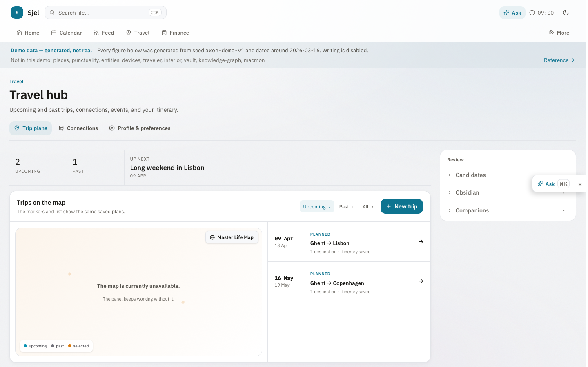
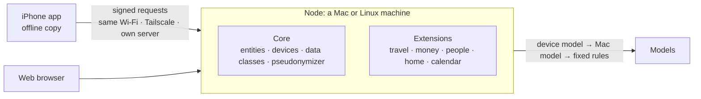

<!-- human-voice: ignore-start rule_of_three -->
<!-- This file enumerates real sets constantly (the four things the spine owns, the three
     surfaces of the control app, the log kinds security covers). Several flagged "triads" are
     four-item lists the check reads as three. Shortening them would delete information to move
     a score, so the category is muted here deliberately. Every other check stays live. -->

<h1 align="center">Sjel</h1>

<b>One household's people, places, trips, money, home and calendar, on devices the household owns, with one assistant that works on that data.</b>

  
  
  

  
  &nbsp;
  

Screenshots: the travel hub in the live demo, synthetic data.

  <a href="https://larsboes.github.io/Sjel/">Live demo</a> ·
  <a href="#try-it">Try it</a> ·
  <a href="#how-it-works">How it works</a> ·
  <a href="#measured">Measured</a> ·
  <a href="research/README.md">Research</a> ·
  <a href="ISA.md">Open work</a>

## What it is

Sjel stores the facts of one person's or one household's life as typed data: people, places,
trips, money, home and calendar. The data stays on hardware the household controls. Screens show
that data, and an assistant works on it.

Sjel has a small core and optional extensions. All extensions live in this repository. Each
installation switches on the extensions it needs.

## Two surfaces: calm on the glass, open in the terminal

Sjel is designed with two deliberate surfaces:

1. **On the glass**: Apple-like simplicity for daily life. Guided device pairing via QR code,
   one-tap local intelligence tuning that auto-detects hardware and quantizations, and zero
   terminal friction for household members. It just works.
2. **Under the hood**: A completely open, scriptable node. Every capability serves a live route
   manifest (`GET /routes`), speaks typed JSON over loopback HTTP, and stores state in queryable
   SQLite files. Developers and operators can drive every workflow from the terminal (`sjel`,
   `sjel capability call`), plug in local models, or automate tasks via standard UNIX tools
   without touching the browser.

## How it works

1. One node, a Mac or a Linux machine, holds the data and accepts every write. Other devices send
   changes to it. A phone edit made on an old copy is refused, and the phone shows both versions.
2. A phone pairs once. It signs every request with its own key, whichever connection it uses.
3. Every value has a data class: Public, Mine, Others (facts about other people) or Secret. A class
   goes up by itself. Only a person, with a written reason, can lower it.
4. Data about other people never reaches a cloud model (`libs/content-item`, `cloud_admission`).
5. Home shows only what still waits for a decision.

## Design rule: clever inside, easy outside

The goal is a system that is easy to use and easy to maintain. The design underneath may be
smart. Using and maintaining it may not require that smartness.

- One way in. A capability is not finished until `sjel` can find it, check its health and call it
  (`sjel capability list`, `sjel capability call`).
- One place per kind of fact. Public code and doctrine live here. Private values and machine state
  live in the overlay. A secret lives in the user's own secret store (the macOS Keychain on a
  Mac), and everything else holds a reference to it.
- No setup step that only its author remembers. If a step must be done by hand, a tool does it
  (`tools/setup-secret.sh`) and `tools/doctor` reports it when it is missing.

## State

| Feature | State |
|---|---|
| Typed people, places, trips, money, home and calendar, with a source on every value | Built |
| iPhone app with an offline copy, paired by device key | Built |
| Same Wi-Fi, Tailscale and own-server connections | Built |
| Pseudonymizer in front of cloud model calls, for the owner's own data | Built, one caller (`comms`) |
| Data about other people sent to a cloud model pseudonymized, or synced end-to-end encrypted | Target |
| Model selection: dual-mechanism — device model or local decision engine, with zero-fail heuristic fallback | Built |
| Assistant that proposes actions and asks before anything that leaves Sjel or cannot be undone | Target. Today it routes by keyword. |
| Mac app | Target |
| iCloud connection, encrypted by Sjel | Target |

## Try it

The [live demo](https://larsboes.github.io/Sjel/) runs the web interface on synthetic data. No
install needed.

To run your own node:

~~~sh
git clone https://github.com/larsboes/Sjel.git
cd Sjel
tools/install.sh
tools/doctor
~~~

You get the web interface at `http://localhost:8082` and the `sjel` command. The installer asks
where to keep your private settings, which live outside this repository. macOS and Linux.
[Start here](CONTRIBUTING.md#start-here) covers the details.

## Measured

Each number names the command that reproduces it.

| What | Result | Reproduce |
|---|---|---|
| Pseudonymizer recall, reversible path | 48/48 (100.0%), gate ≥ 91.7%, measured 2026-09-27 | `cargo run -p comms --bin comms-redaction-eval -- --pseudonymized <corpus>` |
| Redaction recall, destructive path | 48/48 (100.0%), gate ≥ 91.7%, measured 2026-09-27 | the same command without `--pseudonymized` |
| Feed ranking (bge-m3) | 0.941 pairwise, 0.994 mean nDCG, 6/6 useful top-1 | `bun capabilities/comms/eval/run-relevance.ts`, result in `capabilities/comms/eval/results/2026-08-30-bge-m3-ollama.md` |
| Tests | 829 TypeScript tests and 107 Rust test binaries, CI green | `sjel test` and `cargo test --workspace` |

The redaction corpus (24 fixtures) lives in the private settings, so its two rows cannot be re-run
from a public clone. The relevance corpus is public
(`capabilities/comms/eval/relevance-corpus.json`) and needs a local bge-m3. Offline use and pairing
time are not measured yet.

## Structure

An extension is a directory under `capabilities/` with a `service.toml`. `sjel capability list`
shows the ones on this machine.

| Part | Contents |
|---|---|
| Core | `capabilities/entities`, `capabilities/devices`, `libs/content-item`, `libs/pseudonymize`, `libs/sjel-server`, `dashboard/src/lib/intelligence` |
| Travel | `trips`, `transit`, `traveler`, `scouting`, `punctuality`, `sparpreis-watch` (Deutsche Bahn fare alerts) |
| People | `entities-sync`, `entities-google-sync`, `places`, `people-registry` |
| Money | `finance`, `finance-prices` |
| Home | `interior`, `home-assistant`, `soundscape`, `printing` |
| Time and knowledge | `calendar`, `comms`, `knowledge-base`, `knowledge-graph`, `vault` |
| Machines | `host-patch`, `host-watch`, `host-net`, `macmon`, `backup`, `container-refresh` |
| Interfaces | `dashboard` (web and iPhone), `sjel-status` (the node's web server) |

## Scope

- Sjel does not ask for passwords or MFA codes of other services.
- Only first-party extensions run. There is no extension store.
- Prose stays in Obsidian. Sjel stores the structured facts and links to the notes.
- Supported platforms: macOS, Linux and iOS.

## Research

[`research/`](research/README.md) collects the studies and benchmarks behind the project,
including the ones that argue against it.

## License

AGPL-3.0-only ([LICENSE](LICENSE)), from 2026-09-26. Earlier releases are MIT. Contributions carry
a DCO sign-off ([CONTRIBUTING.md](CONTRIBUTING.md#license-and-sign-off)).
